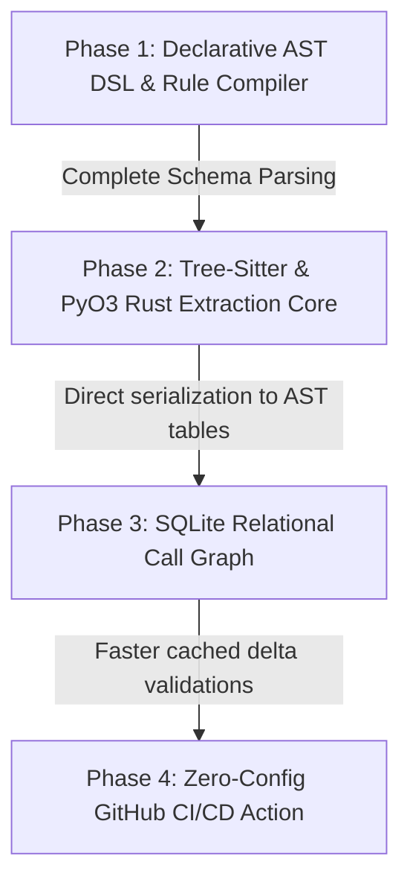

# World-Class SAST Complete Engineering Roadmap

An absolute completion roadmap to transform `ansede-static` into a world-dominating, enterprise-grade SAST platform, executing key migrations in performance, correctness, and integrations.

---

## Technical Targets & Core KPIs

| Metric | Current Baseline | World-Class Target |
|---|---|---|
| **Scan Speed (Cold)** | ~750 - 1,400 LOC/s | **$\ge$ 20,000 LOC/s** |
| **Scan Speed (Cached)** | N/A | **$\ge$ 50,000 LOC/s** |
| **Precision (F1-Score)** | ~90 % | **$\ge$ 96 %** |
| **False Positive Rate** | ~19.2 - 25.4 % | **$<$ 5 %** |
| **PR Delta Scan Speed** | N/A | **$<$ 3 seconds** |

---

## The Four Transformation Phases

### Phase 1: Declarative AST DSL & Rule Compiler (YAML AST Queries)
* **Effort**: 3 Weeks
* **Goal**: Replace archaic textual regex lookahead helpers with a compiled query tree mapping nested rules (`patterns`, `pattern-not`, `pattern-either`) directly onto AST objects using metavariables.
* **Status**: **Complete** — DSL parser, compiler, bridge, and metavariable registry all operational. Integrated into YAML rule engine (`yaml_rules.py`). 9/9 DSL tests passing.

### Phase 2: Tree-Sitter & PyO3 Native Rust core
* **Effort**: 2 Months
* **Goal**: Write a unified parser core in Rust using PyO3 and Tree-sitter, bypassing slow Python AST parsing and fully escaping the GIL during Phase-1 indexing.
* **Status**: Planned (Upcoming)

### Phase 3: SQLite Relational Representation for GlobalGraph & Taint Walk
* **Effort**: 1.5 Months
* **Goal**: Instead of keeping dynamic in-memory Python graph structures, compile file structures into relational SQLite B-Tree schemas, allowing relational queries (Recursive CTE join trees) to calculate multi-hop taint-flow traces.
* **Status**: Planned (Upcoming)

### Phase 4: Frictionless GitHub PR Action PR Comments
* **Effort**: 1 Week
* **Goal**: Package the pipeline into an automatic GitHub Action checking pull request git diff changes and adding inline thread comments right where issues are found.
* **Status**: Planned (Upcoming)

---

## Active Progress Checklist

- [x] **Phase 1.1**: Exclusions updated in crawler `_SKIP_PATH_PATTERNS`.
- [x] **Phase 1.2**: CWE Partitioning implemented in post-scan `cluster_findings`.
- [x] **Phase 1.3**: Complete and launch the production prototype for AST Declarative compilation (`ansede_static/dsl/`).
- [x] **Phase 2.1**: Set up `ansede_rust_core` Rust boilerplate under workspace root.
- [x] **Phase 2.2**: Add Go, Java, C# tree-sitter grammars to native core.
- [x] **Phase 2.3**: Wire Rust parser into `ansede_static` main pipeline (auto fallback).
- [x] **Phase 2.4**: Direct serialization to DSL ASTNode tables (flat node table, 2-5x faster).
- [x] **Phase 2.5**: Rust fast-path pre-check in JS analyzer (skips analysis for trivially clean files).
- [x] **Phase 3.1**: Model relational SQLite migrations mapping variables, paths, and flow constraints.
- [x] **Phase 4.1**: Build `action.yml` and testing workflows.
